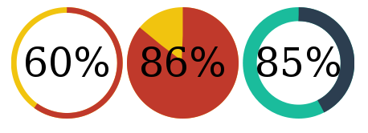

# angular-circles
## Wow, circles!

### What is it?
**angular-circles** is a simple wrapper to use [lugolabs/circles](http://github.com/lugolabs/circles)
in your projects.

Sadly, it's really young, so don't be surprised if something doesn't work, everything is not yet tested.
I could solve bugs if I (or you!) find them.

### How can I use it?
- Include dependencies to your page (angular, circles.js)
- Include angular-circles.js
- Require `angular-circles` as a dependency of your module
- Add the `ng-circles` attribute to any div, and always specify a value
- You are ready to go! See the example folder if you want to customize things
(you have two ways to give settings: `module.config()` or HTML attributes)

### Is there a difference with the original?
Indeed: **our circles are automatically responsive**.

So **you can't set the radius**, since it's automatically half the width of your div.

Therefore, **the width setting is now the percentage of your border width,
compared to your radius**.
Example: Your div is 200px wide. So your radius is 100px. By default, the border width is 10%,
so yours is 10px. If 300px, radius 150px, border 20px. Etc.

### Can I see it in action?
Yup, in example/index.html \o/
What, you don't want to DL & run it? I got you covered,
[this should work online here](http://htmlpreview.github.io/?https://github.com/ActivKonnect/angular-circles/blob/master/example/index.html).

### Can I contrib?
Hell yeah, fork, code, JSLint & pull request :)
